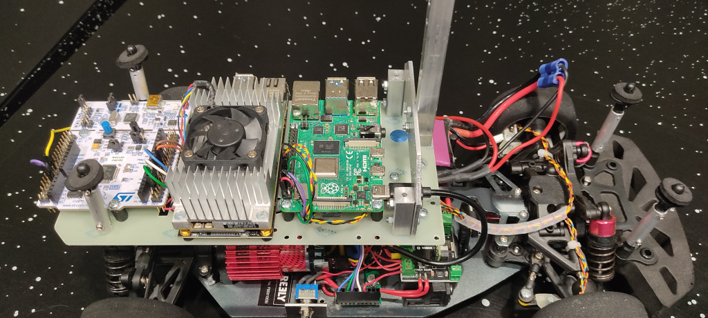
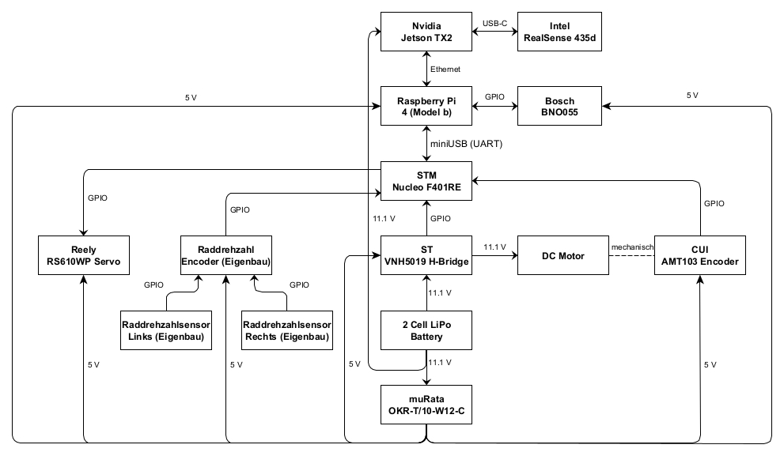
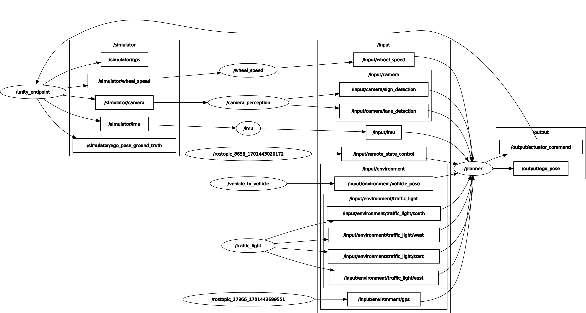

# Table of contents <!-- omit from toc -->
- [Car setup](#car-setup)
- [ROS architecture](#ros-architecture)
  - [Custom messages](#custom-messages)
  - [Input topics](#input-topics)
  - [Simulator topics](#simulator-topics)
  - [Output topics](#output-topics)
  - [Launchfiles](#launchfiles)
- [Software which needs to be flashed onto the vehicle and how to start the vehicle](#software-which-needs-to-be-flashed-onto-the-vehicle-and-how-to-start-the-vehicle)
- [Network setup for the Raspberry Pi and the Nvidia Jetson TX2](#network-setup-for-the-raspberry-pi-and-the-nvidia-jetson-tx2)

# Car setup
<br>
*From left to right: STM Nucleo F401RE, Nvidia Jetson TX2, Raspberry Board Pi 4 Model B*<br>
<br>
*Hardware setup of all components, the connection types and the underlying voltages of the components.*

| Type                           | Name                                     | Number installed | Location           | More information                                                                                                                                               |
| ------------------------------ | ---------------------------------------- | ---------------- | ------------------ | -------------------------------------------------------------------------------------------------------------------------------------------------------------- |
| **Boards**                     |                                          |                  |                    |                                                                                                                                                                |
| Main Computing Unit            | Raspberry Pi 4 Model B                   | 1                | front/center       | https://www.raspberrypi.com/products/raspberry-pi-4-model-b/                                                                                                   |
| Graphics Processing Unit (GPU) | Nvidia Jetson TX2                        | 1                | center             | https://www.nvidia.com/de-de/autonomous-machines/embedded-systems/jetson-tx2/                                                                                  |
| Carrier Board                  | Nvidia Carrier Board J120                | 1                | center             | https://auvidea.eu/j120/                                                                                                                                       |
| Microcontroller                | STM Nucleo F401RE                        | 1                | rear               | https://www.st.com/en/evaluation-tools/nucleo-f401re.html                                                                                                      |
| **Sensors**                    |                                          |                  |                    |                                                                                                                                                                |
| Stereo RGB camera              | Intel RealSense D435                     | 1                | front              | https://www.intelrealsense.com/depth-camera-d435/                                                                                                              |
| Wheelspeed Sensor              | QTR-1A Reflectance Sensor                | 2                | front left & right | https://www.pololu.com/product/2458                                                                                                                            |
| Inertial measuring unit (IMU)  | Bosch BNO055                             | 1                | center             | https://www.bosch-sensortec.com/products/smart-sensors/bno055/                                                                                                 |
| Motor Encoder                  | CUI AMT103                               | 1                | center             | https://www.cuidevices.com/product/motion-and-control/rotary-encoders/incremental/modular/amt10-series                                                         |
| **Actuators**                  |                                          |                  |                    |                                                                                                                                                                |
| Motor                          | Reely MT550 Model ship brushed motor     | 1                | rear               | https://www.conrad.com/p/reely-mt550-model-ship-brushed-motor-396208                                                                                           |
| Motor Driver (H-Bridge)        | VNH5019 Motor Driver Carrier             | 1                | center             | https://www.pololu.com/product/1451                                                                                                                            |
| Steering Servo                 | Reely Servo RS-610WP                     | 1                | front axle         | https://www.conrad.com/p/reely-standard-servo-rs-610wp-mg-analogue-servo-gear-box-material-metal-connector-system-jr-2141322                                   |
| **Others**                     |                                          |                  |                    |                                                                                                                                                                |
| Chassis                        | Reely TC-04 Onroad-Chassis               | 1                | -                  | https://asset.conrad.com/media10/add/160267/c1/-/gl/001406735ML02/manual-1406735-reely-tc-04-onroad-chassis-110-rc-model-car-electric-road-version-4wd-arr.pdf |
| Wheels                         | Matrix MX10-SpecH                        | 4                | -                  | https://www.rc-kleinkram.de/products/19-mx10-spech                                                                                                             |
| Battery                        | Hacker TopFuel LiPo 20C ECO-X 3800mAh 3S | 2                | center             | https://www.scm-modellbau.com/Hacker-TopFuel-LiPo-20C-ECO-X-3800mAh-3S-MTAG                                                                                    |
| Voltage Transformer            | muRata OKR-T/10-W12-C                    | 1                | center             | https://www.murata.com/en-us/products/productdetail?partno=OKR-T%2F10-W12-C                                                                                    |


# ROS architecture

*Overview about the current ROS architecutre*
## Custom messages
Further information about the custom messages, e.g. the physical values of the messages that are referenced below with the prefix `bfmc_interface`, can be found [here](Pi_Platform/src/bfmc_interface/msg).
## Input topics
During real world application, input is provided by the sensors on the vehicle (camera, IMU, wheel speed sensor), V2X communication (traffic lights) from the servers on the race track, and an `/input/remote_state_control` which can be used to manually send a desired state to the vehicle. 
| Topic                                     | Msg-Type                        | Publisher                                                                                                                               | Subscriber                        |
| ----------------------------------------- | ------------------------------- | --------------------------------------------------------------------------------------------------------------------------------------- | --------------------------------- |
| `/input/camera/lane_detection`            | `bfmc_interface::LaneDetection` | `bfmc_input/src/camera_perception/camera_listener_node.cpp`<br>`bfmc_input/src/camera_perception/camera_perception_node.cpp`            | `bfmc_action/src/Environment.cpp` |
| `/input/camera/sign_detection`            | `bfmc_interface::SignDetection` | `bfmc_input/src/camera_perception/camera_listener_node.cpp`<br>`bfmc_input/src/camera_perception/camera_perception_node.cpp`            | `bfmc_action/src/Environment.cpp` |
| `/input/imu`                              | `bfmc_interface::IMU`           | `bfmc_input/scripts/imu/imu_node.py`                                                                                                    | `bfmc_action/src/Environment.cpp` |
| `/input/environment/traffic_light/start`  | `bfmc_interface::TrafficLight`  | `bfmc_input/src/trafficLight/traffic_light_node.py`                                                                                     | `bfmc_action/src/Environment.cpp` |
| `/input/environment/traffic_light/east`   | `bfmc_interface::TrafficLight`  | `bfmc_input/src/trafficLight/traffic_light_node.py`                                                                                     | `bfmc_action/src/Environment.cpp` |
| `/input/environment/traffic_light/south`  | `bfmc_interface::TrafficLight`  | `bfmc_input/src/trafficLight/traffic_light_node.py`                                                                                     | `bfmc_action/src/Environment.cpp` |
| `/input/environment/traffic_light/west`   | `bfmc_interface::TrafficLight`  | `bfmc_input/src/trafficLight/traffic_light_node.py`                                                                                     | `bfmc_action/src/Environment.cpp` |
| `/input/wheel_speed`                      | `bfmc_interface::WheelSpeed`    | `bfmc_input/src/wheelspeed/wheel_speed_node.cpp`                                                                                        | `bfmc_action/src/Environment.cpp` |
| `/input/remote_state_control`             | `std_msgs::UInt8`               | None - Manually publish desired state while testing                                                                                     | `bfmc_action/src/Environment.cpp` |

## Simulator topics
During simulator application, input is provided by the simulator (camera, imu, wheelspeed, gps) and the ground truth of the ego pose is published to validate your algorithms.
| Topic                              | Msg-Type                              | Publisher  | Subscriber                                       |
| ------------------------           | ------------------------------------- | ---------- | ------------------------------------------------ |
| `/simulator/camera`                | `bfmc_interface::SimulatedCamera`     | simulator  | `bfmc_input/src/camera_perception/Camera.cpp`    |
| `/simulator/imu`                   | `bfmc_interface::SimulatedIMU`        | simulator  | `bfmc_input/scripts/imu/imu_node.py`             |
| `/simulator/wheel_speed`           | `bfmc_interface::SimulatedWheelSpeed` | simulator  | `bfmc_input/src/wheelspeed/wheel_speed_node.cpp` |
| `/simulator/gps`                   | `geometry_msgs/PointStamped`          | simulator  | TBD                                              |
| `/simulator/ego_pose_ground_truth` | `geometry_msgs/PoseStamped`           | simulator  | None                                             |

## Output topics
The output contains steering and speed commands sent to the Nucleo board via UART - also see [hardware setup](#car-setup). Furthermore, the calculated localization information (x, y, yaw, nodeID) is published and stored in ROS bags for later analysis. And additionally, the vehicle shall send detected characters and objects to an environment server (live traffic) (currently not implemented).
| Topic                      | Msg-Type                        | Publisher                         | Subscriber                                                  |
| -------------------------- | ------------------------------- | --------------------------------- | ----------------------------------------------------------- |
| `/output/actuator_command` | `bfmc_interface::NucleoCommand` | `bfmc_action/src/Command.cpp`     | `bfmc_output/src/SerialHandler/serial_handler_node.cpp`     |
| `/output/ego_pose`         | `bfmc_interface::EgoPose`       | `bfmc_action/src/Environment.cpp` | None                                                        |


## Launchfiles
Each catkin package (except `bfmc_interface`) contains a launch file to launch all its nodes. These nodes include (depending on the specific package) `imu`, `wheel_speed`, `camera_perception_listener`, `serial_handler`, and `planner`. The `planner` node has several parameters that can be set, such as the start state, the distance to travel, the default speed, the reduced speed, the parking speed, the highway speed, the current node ID, the destination node ID, the initial car pose and the timings for different scenarios. The main launch file to start all relevant car nodes is located inside the `bfmc_interface` package at `Pi_Platform/src/bfmc_interface/launch/run_car_autonomous.launch`. If you are using the simulator, use the provided `Pi_Platform/src/bfmc_interface/launch/run_car_simulated.launch`

There are additional launch files which are stored in Pi_Platform/src/bfmc_interface/launch/tests to test individual scenarios.

| Parameter            | Unit  | Datatype | Description                                                                                |
| -------------------- | ----- | -------- | ------------------------------------------------------------------------------------------ |
| `startState`         | -     | `int`    | Desired state for starting the vehicle                                                     |
| `distanceToDrive`    | [m]   | `float`  | Distance when the vehicle enters the finish state                                          |
| `speedDefault`       | [m/s] | `float`  | Default speed for driving                                                               |
| `speedReduced`       | [m/s] | `float`  | Reduced speed e.g. when approaching intersections, crosswalks                           |
| `speedParking`       | [m/s] | `float`  | speed for parking maneuver                                                              |
| `speedHighWay`       | [m/s] | `float`  | Increased speed when driving on the highway                                             |
| `currentNodeID`      | -     | `int`    | Starting point (ID) for planning the route                                                 |
| `currentNodeID`      | -     | `int`    | End point (ID) for planning the route                                                      |
| `timings/startUp`    | [s]   | `double` | Duration of the boot process of the vehicle                                                |
| `timings/stop`       | [s]   | `double` | Duration of the vehicle stop at stop signs                                                 |
| `timings/pedestrian` | [s]   | `double` | Maximum duration of stopping a vehicle when a pedestrian is detected on the road/crosswalk |
| `initialPoseX`       | [m]   | `float`  | Initial x coordinate of the vehicle on the map                                             |
| `initialPoseY`       | [m]   | `float`  | Initial y coordinate of the vehicle on the map                                             |
| `initialPoseYaw`     | [rad] | `float`  | Initial yaw orientation of the vehicle (default - 270° vehicle faces north)                |
| Unused               |       |          |                                                                                            |
| `raceMode`           | -     | `bool`   | Set raceMode                                                                               |

As options for the parameter `startState` the implemented states of the vehicle are available, which are mapped as follows:
| State name       | State ID |
| ---------------- | -------- |
| `START_UP`       | 0        |
| `FOLLOW_LANE`    | 1        |
| `INTERSECTION`   | 2        |
| `STOP`           | 3        |
| `CROSSWALK`      | 4        |
| `PARKING`        | 5        |
| `ROUTE_PLANNING` | 6        |
| `PRIORITY_ROAD`  | 7        |
| `PEDESTRIAN`     | 8        |
| `SINGLE_ONE_WAY` | 9        |
| `CHANGE`         | 10       |
| `TRAFFIC_LIGHT`  | 11       |
| `ROUNDABOUT`     | 12       |
| `FINISH`         | 31       |

# Software which needs to be flashed onto the vehicle and how to start the vehicle
| Software                   | Sourcecode                 | Information                                                                                                                              |
| -------------------------- | -------------------------- | ---------------------------------------------------------------------------------------------------------------------------------------- |
| Embedded Platform - Nucleo | Nucleo_Platform            | Copy Nucleo_Platform/BUILD/Nucleo_mbedrobot.bin to Nucleo-Board via USB - further information: https://boschfuturemobility.com/embedded/ |
| TX2 Platform - Nvidia TX2  | Jetson_Platform/perception | Build code on Nvidia TX2 Jetson and run ```./perception_process```                                                                       |
| ROS - Raspberry Pi         | Pi_Platform                | Build code on Raspberry Pi and run  ```roslaunch run_car_autonomous.launch```                                                            |

Build the software on the Nvidia Jetson TX2:
```
cd Jetson_Platform/perception
mkdir build && cd build
cmake ..
make -j4 (Check how many cpu cores your system has available with nproc - the Nvidia Jetson TX2 has 4 cores)
```
Build the ROS software on the Raspberry Pi:
```
catkin clean -y   (optional)
catkin build
source devel/setup.bash
```


Start up the vehicle: **Caution**: Process on TX2 Platform needs to be running before starting the ROS launch file otherwise the lane/object detection will not send any data to the Raspberry Pi.
```
./perception_process                                (Nvidia Jetson TX2 - Jetson_Platform/perception/build)
roslaunch bfmc_interface run_car_autonomous.launch  (Raspberry Pi - Pi_Platform)
```
